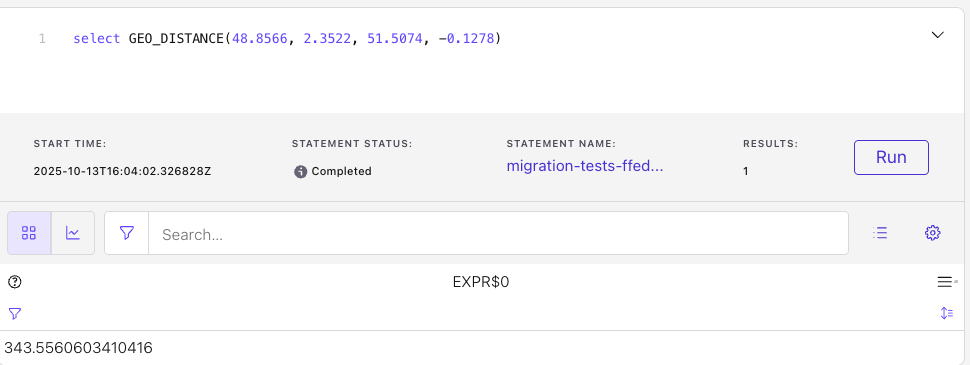

# Haversine Distance UDF for Apache Flink

This project implements a User-Defined Function (UDF) for Apache Flink that calculates the Haversine distance between two geographical points on Earth. The Haversine formula determines the great-circle distance between two points on a sphere given their latitudes and longitudes.

## Overview

The `GeoDistanceFunction` is a scalar function that takes four parameters:
- Latitude of the first point (in degrees)
- Longitude of the first point (in degrees)
- Latitude of the second point (in degrees)
- Longitude of the second point (in degrees)

It returns the distance between the two points on earth in kilometers.

## Deployment

### Confluent Cloud for Flink

* Get FlinkDeveloper RBAC to be able to manage workspaces and artifacts
* Use the Confluent CLI to upload the jar file. Example
    ```sh
    confluent environment list
    # then in your environment
    confluent flink artifact create geo_distance --artifact-file target/geo-distance-udf-1.0-0.jar --cloud aws --region us-west-2 --environment env-nk...
    ```

    ```sh
    +--------------------+--------------+
    | ID                 | cfa-nx6wjz   |
    | Name               | geo_distance |
    | Version            | ver-nxnnnd   |
    | Cloud              | aws          |
    | Region             | us-west-2    |
    | Environment        | env-nknqp3   |
    | Content Format     | JAR          |
    | Description        |              |
    | Documentation Link |              |
    +--------------------+--------------+
    ```

    Also visible in the Artifacts menu
    

* UDFs are registered inside a Flink database
    ```sql
    CREATE FUNCTION GEO_DISTANCE
    AS
    'io.confluent.udf.GeoDistanceFunction'
    USING JAR 'confluent-artifact://cfa-...';
    ```
* Use the function to compute distance between Paris and London:
    


### Confluent Platform Manager for Flink

### Apache Flink

## Usage

### Java Table API

```java
import org.apache.flink.table.api.*;
import static org.apache.flink.table.api.Expressions.*;

TableEnvironment tEnv = TableEnvironment.create(...);

// Register the function
tEnv.createTemporarySystemFunction("GEO_DISTANCE", GeoDistanceFunction.class);

// Use in Table API
Table result = tEnv.from("MyTable")
    .select(call(
        "GEO_DISTANCE",
        $("lat1"), $("lon1"),
        $("lat2"), $("lon2")
    ).as("distance_km"));
```

### SQL


* Define the Function using reference to the artifact created
```sql
-- Use in SQL query
SELECT GEO_DISTANCE(lat1, lon1, lat2, lon2) AS distance_km;
FROM MyTable;
```

## Building

The project uses Maven for dependency management and building. To build the project:

```bash
mvn clean package
```

This will create a JAR file in the `target` directory that you can use with your Flink application.

## Testing

The project includes unit tests that verify the accuracy of the distance calculations. The tests include:
- Known distance between cities (Paris to London)
- Distance to same point (should be 0)
- Distance between antipodal points (opposite sides of Earth)

To run the tests:

```bash
mvn test
```

## Implementation Details

The implementation uses the Haversine formula:

```
a = sin²(Δφ/2) + cos(φ₁)⋅cos(φ₂)⋅sin²(Δλ/2)
c = 2⋅atan2(√a, √(1−a))
d = R⋅c
```

where:
- φ is latitude
- λ is longitude
- R is Earth's radius (6371 km)

The function automatically converts degrees to radians for the calculation.

## Requirements

- Java 17 or later
- Apache Flink 1.18.1 or later
- Maven 3.x
