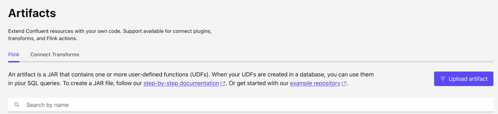

# Sorting Row Array UDF for Apache Flink

This project implements a User-Defined Function (UDF) for Apache Flink that sorts an array of ROW elements based on a specified column index.

## Overview

The `SortingRowArrayFunction` is a scalar function that takes:
- An array of ROW objects
- An integer column index (zero-based)

It returns a new array with the same ROW objects sorted by the values in the specified column.

## Implementation approach

The SortingRowArrayFunction class extends  the flink `ScalarFunction`. And implement the eval method with list of Row.

When deploying on Confluent Cloud, we need to specify the Data mapping so the method signature includes flink DataTypeHint. 

```java
public @DataTypeHint("ARRAY<ROW <item_id INT, item_name STRING, item_description STRING, item_display_order INT>>") Row[] eval(@DataTypeHint("ARRAY<ROW <item_id INT, item_name STRING, item_description STRING, item_display_order INT>>") Row[] rows, Integer columnIndex) {
   
```

Those type hints may be adapted for other use cases.

## Usage

### SQL Example

See code in [cc-flink](./cc-flink/test_sorting_row_array.sql).

```sql
with assets_data (asset_id, item_id, item_name, item_description, item_display_order) as (
    values
        (10, 1,'item1', 'description1', 2 ),
        (20, 2,'item2', 'description2', 1),
        (10, 3,'item3', 'description3', 5),
        (10, 4,'item4', 'description4', 3),
        (20, 5,'item5', 'description5', 4)
)
SELECT
  asset_id,
  SORT_ROW_ARRAY_ON_ID(ARRAY_AGG(ROW(item_id, item_name, item_description, item_display_order)),3) AS items
FROM assets_data
GROUP BY asset_id;
```

## Building the UDF

To build the UDF JAR file:

```bash
mvn clean package
```

The JAR file will be created in the `target` directory: `sorting-row-array-udf-1.0-0.jar`

## Deploying to Confluent Cloud

[See product documentation.](https://docs.confluent.io/cloud/current/flink/concepts/user-defined-functions.html)


### Using the Confluent Console / Artifacts

* From artifacts main page, add artifact

    

* Upload the `sorting-row-array-udf-1.0-0.jar` by specifying the Cloud provider and region:

     


### Using Confluent CLI

```sh
# List your environments
confluent environment list

# Upload the artifact
confluent flink artifact create sorting_row_array \
  --artifact-file target/sorting-row-array-udf-1.0-0.jar \
  --cloud aws \
  --region us-west-2 \
  --environment env-xxxxx
```

### Register the function in Flink SQL within a Catalog:

```sql
CREATE FUNCTION SORT_ROW_ARRAY_ON_ID
AS 'io.confluent.udf.SortingRowArrayFunction'
USING JAR 'confluent-artifact://cfa-xxxxx';
```

## Features

- Sorts arrays of ROW objects by any column
- Handles null values (placed at the end)
- Works with any comparable column type (integers, strings, doubles, etc.)
- Validates input parameters and column indices
- Comprehensive error handling and logging

## Testing

The implementation includes 16 comprehensive unit tests covering:
- Sorting by different column types (integers, strings, doubles, longs)
- Sorting by first, middle, and last columns
- Handling duplicate values
- Handling null values in sort columns
- Edge cases (empty arrays, single rows, null inputs)
- Invalid inputs (negative/out-of-bounds indices)
- Large arrays (100+ rows)
- Complex row structures

Run the tests using:

```bash
mvn test
```

