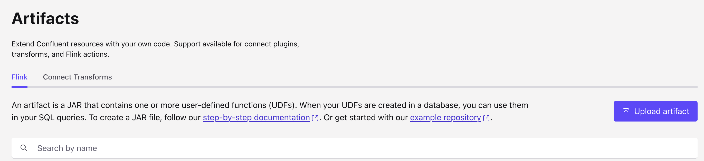
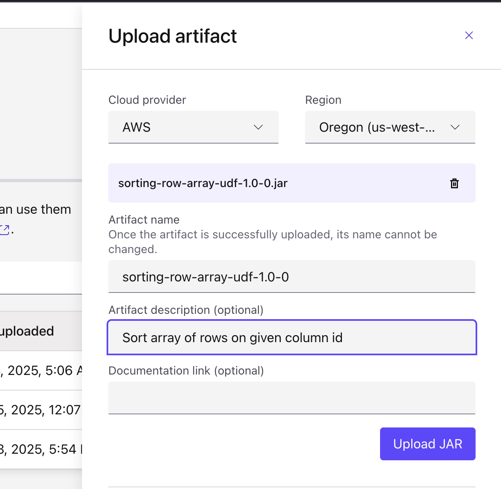

# Sorting Row Array UDF for Apache Flink

This project implements a User-Defined Function (UDF) for Apache Flink that sorts an array of ROW elements based on a specified column index (zero-based). It returns a new array with the same ROW objects sorted by the values in that column.

## Implementation summary

The `SortingRowArrayFunction` is a scalar function (Java class `io.confluent.udf.SortingRowArrayFunction`). It takes an array of ROW objects and an integer column index (zero-based) and returns a new array sorted by the specified column. When deploying on Confluent Cloud, specify the data mapping; the method signature uses Flink `@DataTypeHint` for the ROW structure. Adapt the type hints for your ROW schema.

```java
public @DataTypeHint("ARRAY<ROW<item_id INT, item_name STRING, item_description STRING, item_display_order INT>>") Row[] eval(
    @DataTypeHint("ARRAY<ROW<item_id INT, item_name STRING, item_description STRING, item_display_order INT>>") Row[] rows,
    Integer columnIndex);
```

## Building

The project uses Maven for dependency management and building. To build the project:

```bash
mvn clean package
```

This will create a JAR file in the `target` directory (`target/sorting-row-array-udf-1.0-0.jar`) that you can use with your Flink application or deploy as a function to Confluent Cloud.

## Testing

The implementation includes unit tests covering:
- Sorting by different column types (integers, strings, doubles, longs)
- Sorting by first, middle, and last columns
- Handling duplicate values and null values in sort columns
- Edge cases (empty arrays, single rows, null inputs)
- Invalid inputs (negative/out-of-bounds indices)
- Large arrays and complex row structures

To run the tests:

```bash
mvn test
```

## Deployment

### Confluent Cloud for Flink

[See Confluent cloud product documentation.](https://docs.confluent.io/cloud/current/flink/concepts/user-defined-functions.html)

* Be sure to have a user or service account with FlinkDeveloper RBAC to manage workspaces and artifacts.
* Upload the JAR via Confluent Console > Artifacts > Add artifact, or use the Confluent CLI:

    From artifacts main page, add artifact: 

    Upload `sorting-row-array-udf-1.0-0.jar` by specifying the Cloud provider and region: 

    Or with CLI:

    ```sh
    confluent login
    confluent environment list
    confluent flink artifact create sorting_row_array \
      --artifact-file target/sorting-row-array-udf-1.0-0.jar \
      --cloud aws --region us-west-2 --environment env-xxxxx
    ```

    Example artifact table after creation:

    ```sh
    +--------------------+---------------------+
    | ID                 | cfa-...             |
    | Name               | sorting_row_array   |
    | Version            | ver-...             |
    | Cloud              | aws                 |
    | Region             | us-west-2           |
    | Content Format     | JAR                 |
    +--------------------+---------------------+
    ```

* Register the function in the Flink catalog:

    ```sql
    CREATE FUNCTION SORT_ROW_ARRAY_ON_ID AS 'io.confluent.udf.SortingRowArrayFunction' USING JAR 'confluent-artifact://cfa-...';
    ```

### Apache Flink OSS

Add the UDF JAR to the cluster classpath: place `target/sorting-row-array-udf-1.0-0.jar` in the `lib/` directory of each JobManager and TaskManager, or include it in your job JAR when submitting. Then register the function in a Flink catalog:

```sql
CREATE FUNCTION SORT_ROW_ARRAY_ON_ID AS 'io.confluent.udf.SortingRowArrayFunction' USING JAR 'file:///path/to/sorting-row-array-udf-1.0-0.jar';
```

Or with the Table API: `tEnv.createTemporarySystemFunction("SORT_ROW_ARRAY_ON_ID", SortingRowArrayFunction.class);`

## Usage

See [cc-flink/test_sorting_row_array.sql](./cc-flink/test_sorting_row_array.sql) for a full example. SQL example:

```sql
WITH assets_data (asset_id, item_id, item_name, item_description, item_display_order) AS (
    VALUES
        (10, 1, 'item1', 'description1', 2),
        (20, 2, 'item2', 'description2', 1),
        (10, 3, 'item3', 'description3', 5),
        (10, 4, 'item4', 'description4', 3),
        (20, 5, 'item5', 'description5', 4)
)
SELECT
  asset_id,
  SORT_ROW_ARRAY_ON_ID(ARRAY_AGG(ROW(item_id, item_name, item_description, item_display_order)), 3) AS items
FROM assets_data
GROUP BY asset_id;
```

## Requirements

- Java 17 or later
- Apache Flink 1.18.1 or later
- Maven 3.x
