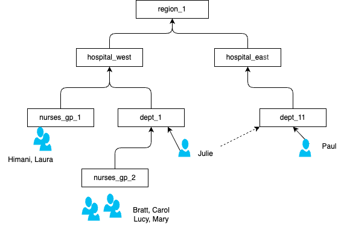

# Traverse User Group Hierarchy UDF for Apache Flink

This Apache Flink User Defined Function flattens a hierarchy of groups and users stored in a single table. Given an array of hierarchy rows (group_name, item_name, item_type) and a root group name, it emits one row per group with the list of persons in that group (including persons in child groups). The hierarchy depth is dynamic and unknown.



* A person can be part of multiple groups; a group can be part of another group; there is one root group.
* Use case: e.g. region > hospitals > departments > groups > persons. The function accumulates persons into each group by flattening the hierarchy.

## Implementation summary

The `HierarchyTraversal` is a Table Function (Java class `io.confluent.udf.HierarchyTraversal`). It takes an array of ROW(group_name, item_name, item_type) and a root group name (e.g. `'Region-1'`), and emits rows (node_name, persons) where persons is the list of user names in that group (including descendants). The hierarchy is built from the array and flattened so that parents contain all persons from child groups.

## Building

The project uses Maven for dependency management and building. To build the project:

```bash
mvn clean package
```

This will create a JAR file in the `target` directory (`target/dynamic-group-hierarchy-udf-1.0-0.jar`) that you can use with your Flink application or deploy as a function to Confluent Cloud.

## Testing

The project includes unit tests that verify:
- Hierarchy flattening and accumulation of persons per group
- Correct output rows (node_name, persons) for a given hierarchy array and root
- Edge cases and multiple groups

To run the tests:

```bash
mvn test
```

## Deployment

### Confluent Cloud for Flink

[See Confluent cloud product documentation.](https://docs.confluent.io/cloud/current/flink/concepts/user-defined-functions.html)

* Be sure to have a user or service account with FlinkDeveloper RBAC to manage workspaces and artifacts.
* Use the Confluent CLI to upload the JAR file. Example:

    ```sh
    confluent login
    confluent environment list
    # then in your environment
    confluent flink artifact create user_group_hierarchy --artifact-file target/dynamic-group-hierarchy-udf-1.0-0.jar --cloud aws --region us-west-2 --environment env-nk...
    ```

    Example artifact table after creation:

    ```sh
    +--------------------+------------------------+
    | ID                 | cfa-...                 |
    | Name               | user_group_hierarchy    |
    | Version            | ver-...                 |
    | Cloud              | aws                     |
    | Region             | us-west-2               |
    | Environment        | env-...                 |
    | Content Format     | JAR                     |
    +--------------------+------------------------+
    ```

* Register the function in the Flink catalog:

    ```sql
    CREATE FUNCTION USERS_IN_GROUPS AS 'io.confluent.udf.HierarchyTraversal' USING JAR 'confluent-artifact://cfa-...';
    ```

* To deploy a new UDF version: drop the function (`DROP FUNCTION USERS_IN_GROUPS`), delete or replace the artifact, upload the new JAR, then recreate the function with the new artifact ID.

### Apache Flink OSS

Add the UDF JAR to the cluster classpath: place `target/dynamic-group-hierarchy-udf-1.0-0.jar` in the `lib/` directory of each JobManager and TaskManager, or include it in your job JAR when submitting. Then register the function in a Flink catalog:

```sql
CREATE FUNCTION USERS_IN_GROUPS AS 'io.confluent.udf.HierarchyTraversal' USING JAR 'file:///path/to/dynamic-group-hierarchy-udf-1.0-0.jar';
```

Or with the Table API: `tEnv.createTemporarySystemFunction("USERS_IN_GROUPS", HierarchyTraversal.class);`

## Usage

Store group and user assignment in a table (e.g. group_name, item_name, item_type with values `'GROUP'` or `'PERSON'`). Collect the hierarchy into an array and call the UDF with LATERAL TABLE:

```sql
CREATE TABLE group_hierarchy (
    id INT PRIMARY KEY NOT ENFORCED,
    group_name STRING,
    item_name STRING,
    item_type STRING NOT NULL  -- 'GROUP' or 'PERSON'
    -- created_at TIMESTAMP, etc.
);
```

```sql
WITH hierarchy_array AS (
    SELECT ARRAY_AGG(ROW(group_name, item_name, item_type)) AS hierarchy_data
    FROM group_hierarchy
)
SELECT t.node_name, t.persons
FROM hierarchy_array AS h,
     LATERAL TABLE(USERS_IN_GROUPS(h.hierarchy_data, 'Region-1')) AS t(node_name, persons);
```

Example expected result: one row per group with node_name and the list of persons in that group (including persons in child groups). Example: nurses_gp_1 -> [Himani, Laura]; region_1 -> [Bratt, Carol, Himani, Julie, Laura, Lucy, Mary, Paul].

Full testing scenario: define the source table, insert records, validate output; add a new group with users and verify parent groups are updated accordingly.

## Requirements

- Java 17 or later
- Apache Flink 1.18.1 or later
- Maven 3.x
