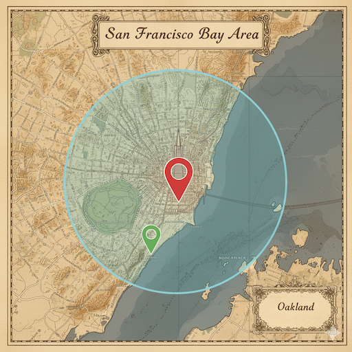
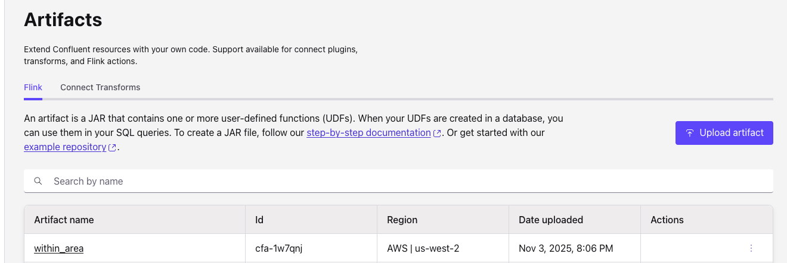
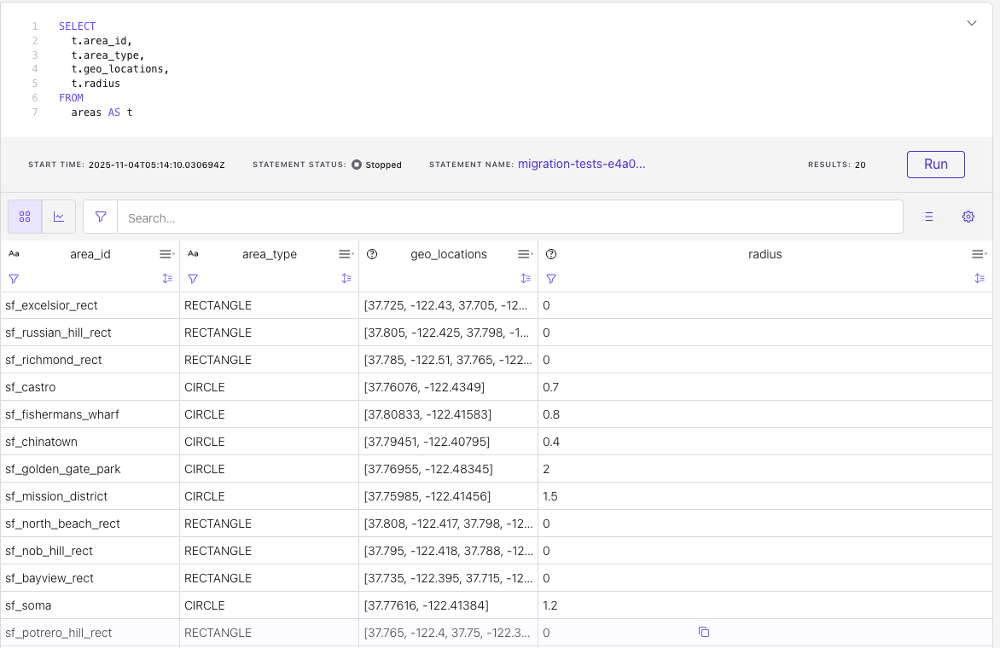
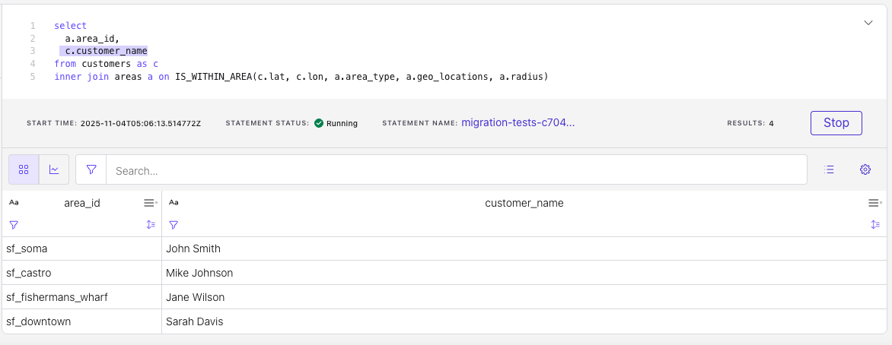
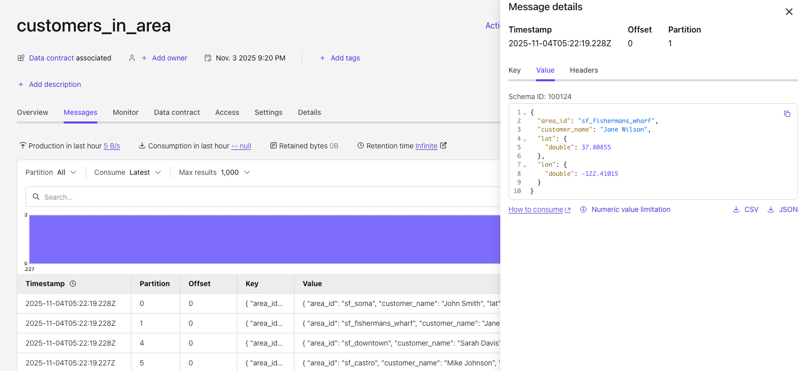

# Within Area

This Apache Flink User Defined Function helps to assess if a geo location is within an area. The area may be a rectangle between two geo locations, or a circle around a geo location given its radius. 


*Created with Google gemini*

The locations will be defined in a table with the following definition: area_id, area_type, geo_locations as an array, radius as optional. The number of areas will be around 10k.

The areas are defined in a table format 

```sql
create table areas (
    area_id STRING,
    area_type STRING,
    geo_locations ARRAY<DOUBLE>,
    radius DOUBLE,
    primary key(area_id) not enforced
) WITH (
  ...
)
```

See file [ddl.area.sql](./sql-scripts/ddl.areas.sql)

It may be possible to write as json array document to iterate over, and use a Kafka producer to write to the areas topic.

```json
[{  area_id: 'A1'
    area_type:  'rectangle'
    geo_locations: [lat1, lon1, lat2, lon2],
    radius: 0
 },
 {  area_id: 'A2'
    area_type:  'circle'
    geo_locations: [lat1, lon1],
    radius: 10
 },
]
```

For the rectangle the function get two points in array (maybe [lat1, lon1, lat2, lon2]). For Circle area there is a single point in array and radius optional.

```sql
INSERT INTO areas (area_id, area_type, geo_locations, radius) VALUES 
('sf_downtown', 'CIRCLE', ARRAY[ROW(37.78825, -122.40640)], 1.0),
('sf_nob_hill_rect', 'RECTANGLE', ARRAY[
    37.79500, -122.41800,
    37.78800, -122.40800]
], 0.0), 
```

If you have *many* areas (e.g. >10 k) and want to test a point against all of them, a single scalar UDF can become a bottleneck.  In that case broadcast the area table and use a `TableFunction` that emits each matching area id. Or pre‑compute a spatial index (e.g. a simple grid or a R‑Tree) and encode it in your data so that the UDF only looks up relevant candidates.

The haversine formula gives ~10 m precision on Earth’s surface – fine for most use cases.  For sub‑meter accuracy use a geodesic library.

For polygons larger than a circle, you can switch to a [Java Topology Suite (JTS)](https://docs.geotools.org/stable/javadocs/org/geotools/geometry/jts/JTS.html) `Polygon` and use `contains(Point)` – that will require adding JTS to the classpath.

As an alternate implementation, the eval() function may return the area_id(s) instead of returning a boolean, create a `TableFunction<String>` that `collect(area_id` for each area that contains the point.

## How to use the function

In SQL to getthe customers within an area: 

```sql
SELECT 
    a.area_id,
    c.customer_name
FROM customers c
INNER JOIN areas a
ON is_within_area(c.lat, c.lon, a.area_type, a.geo_locations, a.radius);
```

See below to do an end to end tests to demonstrate the UDF on Confluent Cloud.

## Building

The project uses Maven for dependency management and building. To build the project:

```bash
mvn clean package
```

This will create a JAR file in the `target` directory that you can use it your Flink application or deployed as a function to Confluent Cloud.

### Unit Testing

The project includes unit tests that verify the accuracy of the distance calculations. The tests include:
- Known distance between cities (Paris to London)
- Distance to same point (should be 0)
- Distance between antipodal points (opposite sides of Earth)

To run the tests:

```bash
mvn test
```

## Deployment

### Confluent Cloud for Flink

* Get FlinkDeveloper RBAC to be able to manage workspaces and artifacts
* Use the Confluent CLI to upload the jar file. Example
    ```sh
    confluent environment list
    # then in your environment
    confluent flink artifact create within_area --artifact-file target/within-area-udf-1.0-0.jar --cloud aws --region us-west-2 --environment env-nk...
    ```

    ```sh
    +--------------------+-------------+
    | ID                 | cfa-1w7qnj  |
    | Name               | within_area |
    | Version            | ver-w2y0ym  |
    | Cloud              | aws         |
    | Region             | us-west-2   |
    | Environment        | env-nknqp3  |
    | Content Format     | JAR         |
    | Description        |             |
    | Documentation Link |             |
    ```

    Also visible in the Artifacts menu
    

* UDFs are registered inside a Flink database using the Artifact ID.
    ```sql
    CREATE FUNCTION IS_WITHIN_AREA
    AS
    'io.confluent.udf.WithinAreaFunction'
    USING JAR 'confluent-artifact://cfa-...';
    ```

Using Confluent Cloud Flink Worksspace 
* Create the areas and customers table.
    * See [ddl.test_customers.sql](./sql-scripts/ddl.test_customer.sql)
    * See [ddl.areas.sql](./sql-scripts/ddl.areas.sql)

* Insert areas using [insert_areas.sql](./sql-scripts/insert_areas.sql)
* Insert customers using [insert_customers.sql](./sql-scripts/insert_customers.sql)
* Verify records
    ```sql
    SELECT
        t.area_id,
        t.area_type,
        t.geo_locations,
        t.radius
    FROM areas AS t
    ```

    

* Create sink table: [ddl.customers_in_area.sql](./sql-scripts/ddl.customers_in_area.sql)
* Final business logic: [dml.customers_in_area.sql](./sql-scripts/dml.customers_in_area.sql)
    ```sql
    insert into `customers_in_area` select 
        a.area_id,
        c.customer_name,
        c.lat,
        c.lon
    from customers as c 
    inner join areas a on IS_WITHIN_AREA(c.lat, c.lon, a.area_type, a.geo_locations, a.radius)
    ```

* See result in table format
    

* See results in resulting topic:
    

* Clean up:
    ```sql
    drop table customers_in_area;
    drop table customers;
    drop table areas;
    ```

* To delete the function use: `DROP FUNCTION IS_WITHIN_AREA`

