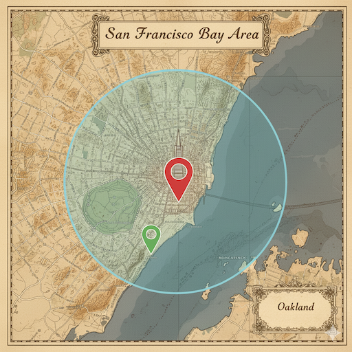
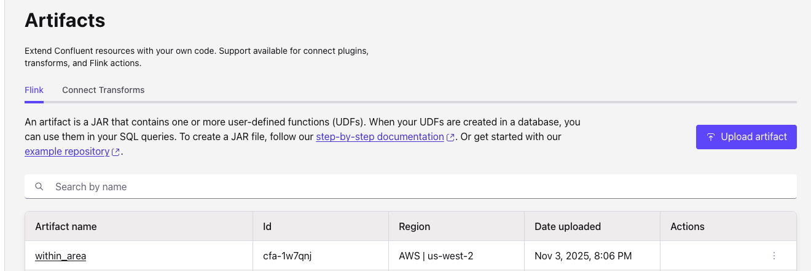
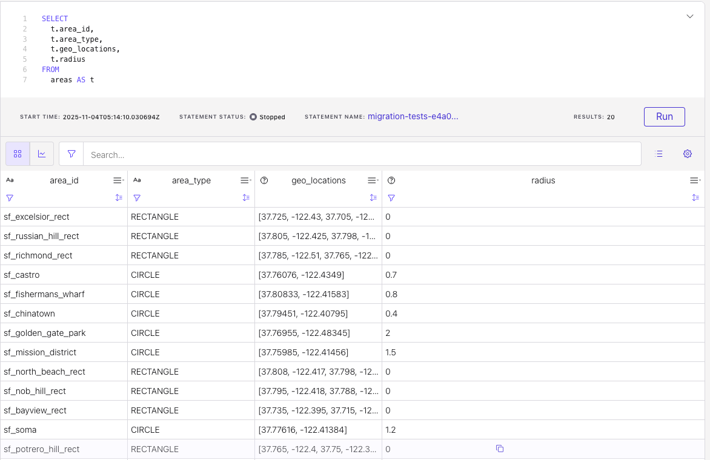
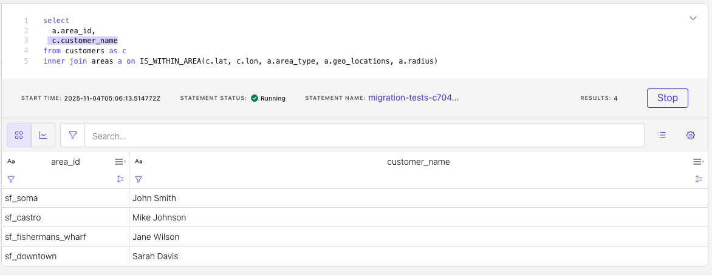
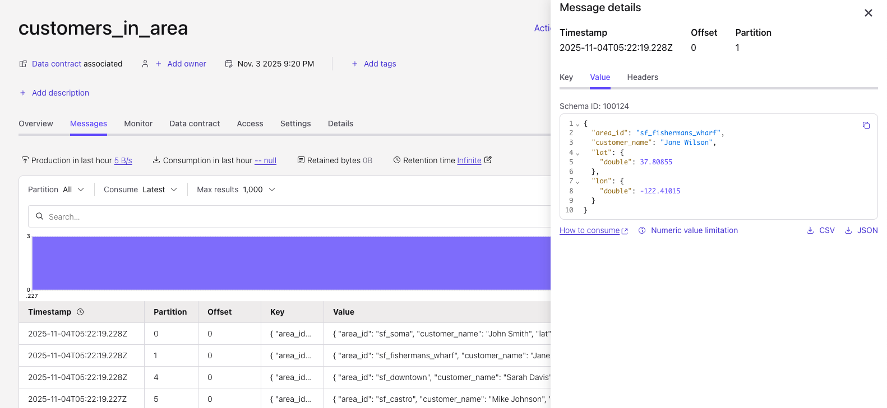

# Within Area UDF for Apache Flink

This Apache Flink User Defined Function checks whether a geo location (point) is within an area. Areas can be a rectangle between two geo locations or a circle around a geo location given its radius.


*Created with Google gemini*

## Implementation summary

The `WithinAreaFunction` is a scalar function (Java class `io.confluent.udf.WithinAreaFunction`). It takes:
- Point latitude and longitude (degrees)
- Area type: `"RECTANGLE"` or `"CIRCLE"`
- `geo_locations`: `ARRAY<DOUBLE>` (four values for rectangle [lat1, lon1, lat2, lon2]; two for circle [centerLat, centerLon])
- `radius`: DOUBLE in meters (only for circles)

It returns true if the point is inside the area, false otherwise. The implementation uses the Haversine formula for circles (~10 m precision). For polygons or sub-meter accuracy, consider JTS or a geodesic library.

## Building

The project uses Maven for dependency management and building. To build the project:

```bash
mvn clean package
```

This will create a JAR file in the `target` directory (`target/within-area-udf-1.0-0.jar`) that you can use with your Flink application or deploy as a function to Confluent Cloud.

## Testing

The project includes unit tests that verify point-in-rectangle and point-in-circle behavior. The tests include:
- Point inside and outside rectangles
- Point inside and outside circles (Haversine distance vs radius)
- Malformed or null inputs

To run the tests:

```bash
mvn test
```

## Deployment

### Confluent Cloud for Flink

[See Confluent cloud product documentation.](https://docs.confluent.io/cloud/current/flink/concepts/user-defined-functions.html)

* Be sure to have a user or service account with FlinkDeveloper RBAC to manage workspaces and artifacts.
* Use the Confluent CLI to upload the JAR file. Example:

    ```sh
    confluent login
    confluent environment list
    # then in your environment
    confluent flink artifact create within_area --artifact-file target/within-area-udf-1.0-0.jar --cloud aws --region us-west-2 --environment env-nk...
    ```

    ```sh
    +--------------------+-------------+
    | ID                 | cfa-1w7qnj  |
    | Name               | within_area |
    | Version            | ver-w2y0ym  |
    | Cloud              | aws         |
    | Region             | us-west-2   |
    | Environment        | env-nknqp3  |
    | Content Format     | JAR         |
    | Description        |             |
    | Documentation Link |             |
    +--------------------+-------------+
    ```

    Also visible in the Artifacts menu
    

* Register the UDF inside a Flink database using the artifact ID:

    ```sql
    CREATE FUNCTION IS_WITHIN_AREA
    AS
    'io.confluent.udf.WithinAreaFunction'
    USING JAR 'confluent-artifact://cfa-...';
    ```

* End-to-end test on Confluent Cloud Flink workspace:
    * Create the areas and customers tables: [ddl.test_customers.sql](./sql-scripts/ddl.test_customer.sql), [ddl.areas.sql](./sql-scripts/ddl.areas.sql)
    * Insert areas using [insert_areas.sql](./sql-scripts/insert_areas.sql) and customers using [insert_customers.sql](./sql-scripts/insert_customers.sql)
    * Verify: `SELECT t.area_id, t.area_type, t.geo_locations, t.radius FROM areas AS t` — 
    * Create sink table: [ddl.customers_in_area.sql](./sql-scripts/ddl.customers_in_area.sql)
    * Run business logic: [dml.customers_in_area.sql](./sql-scripts/dml.customers_in_area.sql)
    * See result in table format:  and in sink topic: 
    * Clean up: `DROP TABLE customers_in_area; DROP TABLE customers; DROP TABLE areas;` and `DROP FUNCTION IS_WITHIN_AREA`

### Apache Flink OSS

Add the UDF JAR to the cluster classpath: place `target/within-area-udf-1.0-0.jar` in the `lib/` directory of each JobManager and TaskManager, or include it in your job JAR when submitting. Then register the function in a Flink catalog:

```sql
CREATE FUNCTION IS_WITHIN_AREA AS 'io.confluent.udf.WithinAreaFunction' USING JAR 'file:///path/to/within-area-udf-1.0-0.jar';
```

Or with the Table API: `tEnv.createTemporarySystemFunction("IS_WITHIN_AREA", WithinAreaFunction.class);`

## Usage

Define areas in a table (e.g. area_id, area_type, geo_locations, radius). See [ddl.area.sql](./sql-scripts/ddl.areas.sql).

```sql
CREATE TABLE areas (
    area_id STRING,
    area_type STRING,
    geo_locations ARRAY<DOUBLE>,
    radius DOUBLE,
    PRIMARY KEY(area_id) NOT ENFORCED
) WITH (...);
```

Example: find customers within an area:

```sql
SELECT a.area_id, c.customer_name
FROM customers c
INNER JOIN areas a
ON IS_WITHIN_AREA(c.lat, c.lon, a.area_type, a.geo_locations, a.radius);
```

For rectangles use geo_locations as [lat1, lon1, lat2, lon2]; for circles use [centerLat, centerLon] and radius in meters. If you have many areas (e.g. >10k), consider broadcasting the area table and using a TableFunction, or pre-computing a spatial index.

## Requirements

- Java 17 or later
- Apache Flink 1.18.1 or later
- Maven 3.x
