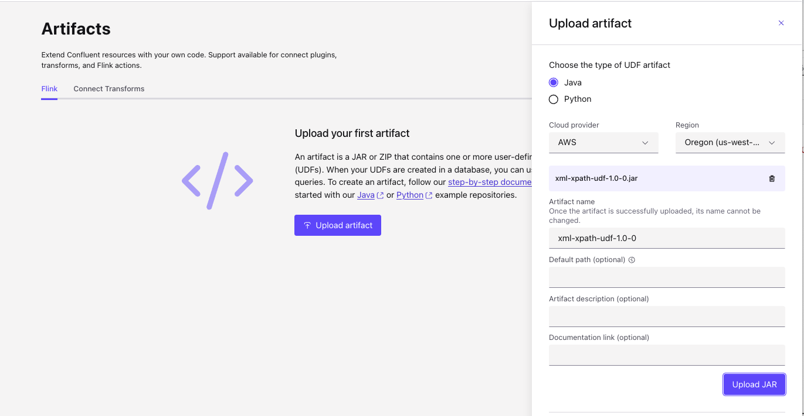
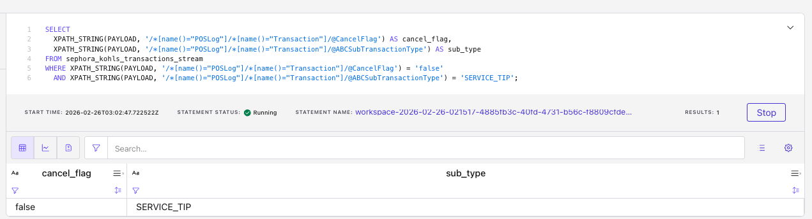

# XML Payload with XPath expression to extract element in Flink SQL

This User Defined Function extracts content from a column containing an XML document using an XPath expression and returns it as a string. Use the function multiple times in a SELECT with different XPath expressions to create matching columns (one column per extraction).

Register the function in your Flink catalog as `xpath_string` (Java class: `io.confluent.udf.XmlXpathFunction`).

## Usage

The input record is generic in the form:

```sql
CREATE TABLE my_table (
    payload STRING
);
```

Extract attributes or element text and filter:

```sql
SELECT
  XPATH_STRING(PAYLOAD, '/*[name()="POSLog"]/*[name()="Transaction"]/@CancelFlag') AS cancel_flag,
  XPATH_STRING(PAYLOAD, '/*[name()="POSLog"]/*[name()="Transaction"]/@ABCSubTransactionType') AS sub_type
FROM stores_storedigital_retail_saletransactions
WHERE XPATH_STRING(PAYLOAD, '/*[name()="POSLog"]/*[name()="Transaction"]/@CancelFlag') = 'false'
  AND XPATH_STRING(PAYLOAD, '/*[name()="POSLog"]/*[name()="Transaction"]/@ABCSubTransactionType') = 'SERVICE_TIP';
```

For documents with default or explicit XML namespaces, use namespace-agnostic XPath such as `name()` or `local-name()` (e.g. `/*[name()="POSLog"]`) so element names match without binding a namespace prefix.


## Requirements

- Java 17 or later
- Apache Flink 1.18.1 or later
- Maven 3.x

### Implement the scalar UDF in XmlXpathFunction.java

* Extend ScalarFunction and expose a single evaluation method: 
    ```java
    public String eval(String xml, String xpathExpression)
    ```
* Parsing and XPath (JDK only):
    * Parse xml with DocumentBuilderFactory / DocumentBuilder and InputSource(new StringReader(xml)).
    * Evaluate xpathExpression with XPathFactory.newInstance().newXPath() and xpath.evaluate(expr, doc, XPathConstants.STRING) (or NODESET and take the first node’s text/attribute value) so that both element text and attribute selections (e.g. /@CancelFlag) work.

* Null/empty handling: If xml or xpathExpression is null or blank, return null. If parsing or evaluation throws, log and return null so the pipeline does not fail.
* Namespace-agnostic XPath: The README uses expressions like /*[name()="POSLog"]/*[name()="Transaction"]/@CancelFlag. JAXP supports this; no need to set a namespace context for that pattern. Optionally document that for default-namespace documents, local-name()/name() in XPath is recommended.
* Naming: Override toString() to return a stable name (e.g. "XPATH_STRING") for registration; the catalog can still register the function as xpath_string in SQL.

## Building

The project uses Maven for dependency management and building. To build the project:

```bash
mvn clean package
```

This will create a JAR file in the `target` directory that you can use it your Flink application or deployed as a function to Confluent Cloud.

### Unit Testing

```sh
mvn test
```

## Deploying to Confluent Cloud

[See product documentation.](https://docs.confluent.io/cloud/current/flink/concepts/user-defined-functions.html)

* Using the Confluent Console > Artifact > Upload artifact
    
   
   Be sure to get the artifact unique identifier.

* As an alternative, using the Confluent CLI to upload the jar file. Example
    ```sh
    confluent environment list
    # then in your environment
    confluent flink artifact create xml-xpath-udf --artifact-file target/xml-xpath-udf-1.0-0.jar --cloud aws --region us-west-2 --environment env-nk...
    ```

* Declare the function in the Flink Catalog:
```sql
CREATE FUNCTION XPATH_STRING
AS
'io.confluent.udf.XmlXpathFunction'
USING JAR 'confluent-artifact://cfa-qj...';
```

## Test in Confluent Cloud

```sh
INSERT INTO stores_storedigital_retail_saletransactions (PAYLOAD) VALUES
-- XML has CancelFlag = "false", ABCSubTransactionType = "SALE"
('<POSLog><Transaction CancelFlag="false" ABCSubTransactionType="SALE"></Transaction></POSLog>'),
-- XML has CancelFlag = "true", ABCSubTransactionType = "RETURN"
('<POSLog><Transaction CancelFlag="true" ABCSubTransactionType="RETURN"></Transaction></POSLog>'),
-- XML is missing CancelFlag (should yield null)
('<POSLog><Transaction ABCSubTransactionType="INQUIRY"></Transaction></POSLog>'),
-- XML with no attributes
('<POSLog><Transaction></Transaction></POSLog>'),
-- Non-matching root element, should not match xpath used in doc example
('<OtherRoot><Transaction CancelFlag="false" ABCSubTransactionType="SALE"></Transaction></OtherRoot>'),
('<POSLog><Transaction CancelFlag="true" ABCSubTransactionType="SERVICE_TIP"></Transaction></POSLog>'),
('<POSLog><Transaction CancelFlag="false" ABCSubTransactionType="SERVICE_TIP"></Transaction></POSLog>'),;
```

Here is an example of output:

